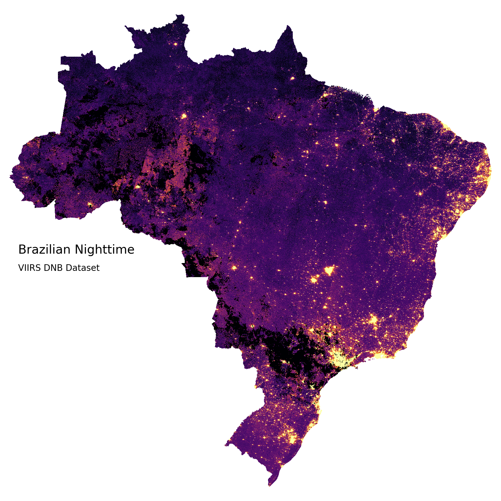

# Investigating Brazilian Nighttime

## Description

This is my initial project to investigate **Brazilian Nighttime**. Here, I used Visible Infrared Imaging Radiometer Suite (VIIRS) Day-Night band (VIIRS DNB), available on Google Earth Engine repository. The VIIRS is one of the satellite products that provide a global measurement of nocturnal visible and near-infrared light to monitor Earth and extract interesting insights.

"The VIIRS DNB's ultra-sensitivity in lowlight conditions enable us to generate a new set of science-quality nighttime products that manifest substantial improvements in sensor resolution and calibration when compared to the previous era of Defense Meteorological Satellite Program/Operational Linescan System’s (DMSP/OLS) nighttime lights image products."

[Info extracted from NASA LAADS site](https://ladsweb.modaps.eosdis.nasa.gov/missions-and-measurements/viirs/).

## Motivation :earth_americas: :satellite:
Nightime brightness has many interesting applications (government defense, climatology, social studies), one of them, measures a country's development by nighttime brightness. However, that is a lack of studies using this data to analyze Brazil. So, here I will start how can we extract basic information from it and correlate with another Brazilian dataset (as Brazilian Institute of Geography and Statistics, IBGE, or Institute for Applied Economic Research, IPEA).

## Prerequisite:
To reproduce this you need to follow these steps:
1. Create an account on [Google Earth Engine](https://earthengine.google.com/)
2. Install necessary libraries in requirements.txt
3. Execute the script *download_images.py* to access Google Earth Engine (GEE) repository and save all images on your Google Drive account. After it, you need to download them to your computer.
4. Follow the script *nighttime.ipynb* 

## Acknowledgments
This project is under construction, so suggestions are welcomed!

## License
Please, reference me.

## Authors:
*  Laíza Cavalcante

## Reference:
*  [NASA Level-1 and Atmosphere Archive & Distribution System](https://ladsweb.modaps.eosdis.nasa.gov/missions-and-measurements/products/VNP46A1/)
*   [VIIRS Land](https://viirsland.gsfc.nasa.gov/Products/NASA/BlackMarble.html)

